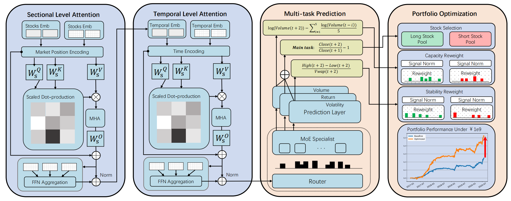

# Readme 
This is the official code and supplementary materials for our AAAI-2026 paper: **LiMT: Hierarchical Multi-Task Framework for Stock Price Forecasting**. 



Our original experiments were conducted in a complex business codebase developed based on Qlib. The original code is confidential and exhaustive. In order to enable anyone to quickly use LiMT, here we publish our well-processed data and core code. 

## Usage
1. Install dependencies.
- pandas == 1.5.3
- torch == 1.11.0

2. Install [Qlib](https://github.com/microsoft/qlib). We have minimized the reliance on Qlib, and you can simply install it by
- <code>pip install pyqlib==0.8.6</code>

3. Download data and unpack it into <code> data/ </code>

4. Run main.py. Depending on which data you want to train on, remember to change the lines in <code> base_model.py/SequenceModel/train_epoch </code>.

5. We provide models trained on the original data or opensource data: <code> model/csi300_original_0.pkl, model/csi800_original_0.pkl, model/csi300_opensource_0.pkl, model/csi800_opensource_0.pkl</code>


## Dataset
### Form
The downloaded data is split into training, validation, and test sets, with two stock universes. Note the csi300 data is a subset of the csi800 data. You can use the following code to investigate the **datetime, instrument, and feature formulation**.
We provide the csi300 and csi500 data in the following linke. You can download and use them as dataset.
- :fire:[Kuake link](https://pan.quark.cn/s/468880eeb1bc). 
```python
with (f'data/R_Vol2_Vola2_csi300_Alpha158/dl_train.pkl', 'rb') as f:
    dl_train = pickle.load(f)
    dl_train.data # a Pandas dataframe
```
In our codebase, the data are gathered chronically and then grouped by prediction dates. the <code> data </code> iterated by the data loader is of shape (N, T, F), where:
- N - number of stocks. For CSI300, N is around 300 on each prediction date; For CSI500, N is around 500 on each prediction date.
- T - length of lookback_window, T=21.
- F - 161 in total, including 158 factors, and 3 labels.        

### Preprocessing
The published data went through the following necessary preprocessing. 

1. For features, we first perform [**RobustZScoreNorm**](https://github.com/microsoft/qlib/blob/main/qlib/data/dataset/processor.py), which computes median and MAD for each feature of all stocks in the training timespan for normalization. It then clips outliers as -3 and 3. When processing the test data, the median and MAD for each feature are **estimated by** (or borrowed from) the training data, so that we have no data leakage. We then use [**Fillna**](https://github.com/microsoft/qlib/blob/main/qlib/data/dataset/processor.py) to fill the NA features by 'ffil + mean'. 
   
2. For labels, **during training**, we perform [**CSZscoreNorm**](https://github.com/microsoft/qlib/blob/main/qlib/data/dataset/processor.py). The downloaded **original training data** already performed  DropNA DropExtreme, and CSZscoreNorm on labels. The downloaded opensource training, validation, and test data, only performed DropNA labels. We clumsily perform DropExtreme and CSZscoreNorm for training. Please refer to the comments in <code>base_model.py/SequenceModel/train_epoch </code>.

**CSZcoreNorm** is a common practice in Qlib to standardize the labels for stock price forecasting. Here 'CS' stands for Cross-Sectional, which means we group the labels on each date and compute mean/std across stocks for normalization. 

Note that for the reported metrics (IC, RankIC, etc.), **whether to normalize the groundtruth label won't change the value**, and nan in the groundtruth will be ignored.

## 📦 File Overview

| File | Description |
|------|-------------|
| `main.py` | Main training script. Loads datasets, instantiates the model, and performs training and evaluation. All hyper-parameters are exposed through command-line arguments. |
| `get_test_result.py` | Get the model's results on the validation set and test set |
| `limt.py` | Model zoo. Contains the model architecture used in the paper. |
| `base_model.py` | Core training logic. Defines the `SequenceModel` base class, loss functions (MSE, multi-task, ordinal classification), metrics (IC, ICIR, etc), and data loaders. |
| `utils.py` | Utility functions: deterministic seeding, directory management, file backup, and efficient time-series sampling (`TSDataSampler`, `DailyBatchSamplerRandom`). |


